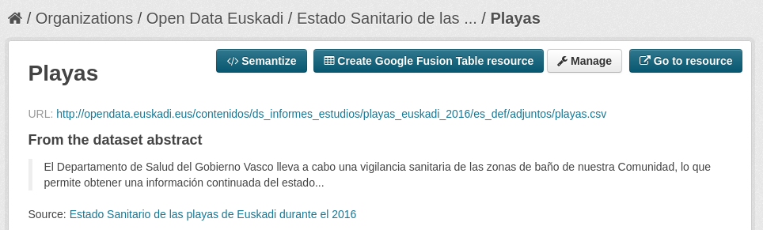
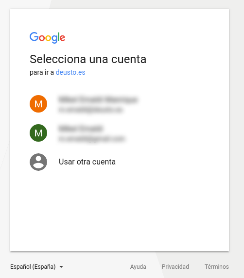
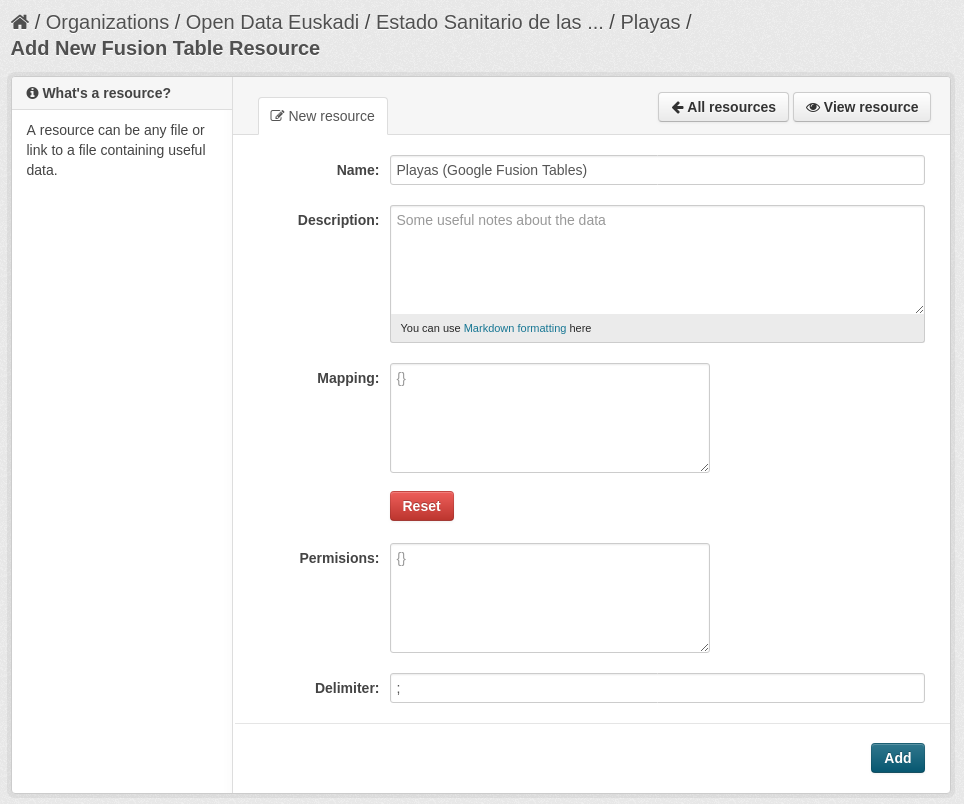
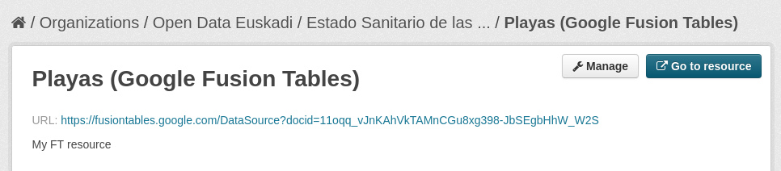
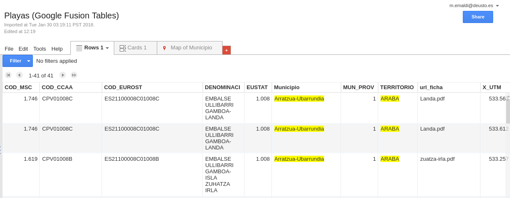

# Google Fusion Tables

ckanext-google_ft extension allows exporting resources from CKAN to Google Fusion Tables.
For starting the exporting process, click on "Create Google Fusion Table resource".

At first, it redirects to Google Authentication page:

Next, the new resource must be configured:

* Name of the resource.
* Description of the resource.
* Delimiter: delimiter of the CSV file.

The new resource is created:

Clicking on resource's URL, it can be edited using Google Fusion Tables tool.

