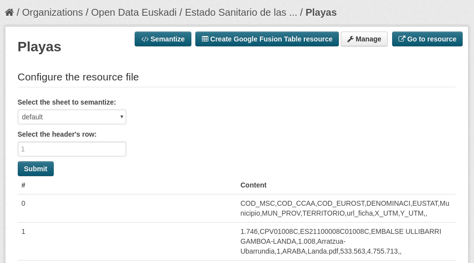

Ontorec
=======

Ontorec allows generating RDF documents from structured non-semantic files. At this moments it supports CSV, XLS and XLSX file types.

Semantizing a resource
--------------------

Given a CSV, XLS or XLSX resource, you can click on "Semantize" button in its description page for starting the semantization process.

At first, Ontorec tries to extract relevant words from the resource and check related ontologies at [Watson](http://watson.kmi.open.ac.uk/WatsonWUI/).

Next, ontologies to be used must be selected and the datasource must be configured:

* Select ontologies: clicking on each ontology, its classes and properties are shown.
* Add your custom ontology: this field allows adding ontologies manually from its URL.

If the datasource file type is CSV, there are some additional properties:

* Field delimiter: character used for delimiting fields in the source CSV
* Quote character: character used for quoting string values in the source CSV.
* Encoding: encoding of the CSV file.

Next, some information about the structure of the file must be provided. In the case of XLS and XLSX files, the sheet from which the data is going to be semantized must be provided. In the case of CSV files, the row in which the headers of the spreadsheet are must be provided.

At last, the class of the objects to be generated and the mapping among columns and properties must be done.
A class and properties could be selected from loaded ontologies, or an ad-hoc one could be established is there is no fitting property or class.

After completing this step, the new RDF resource is published:

