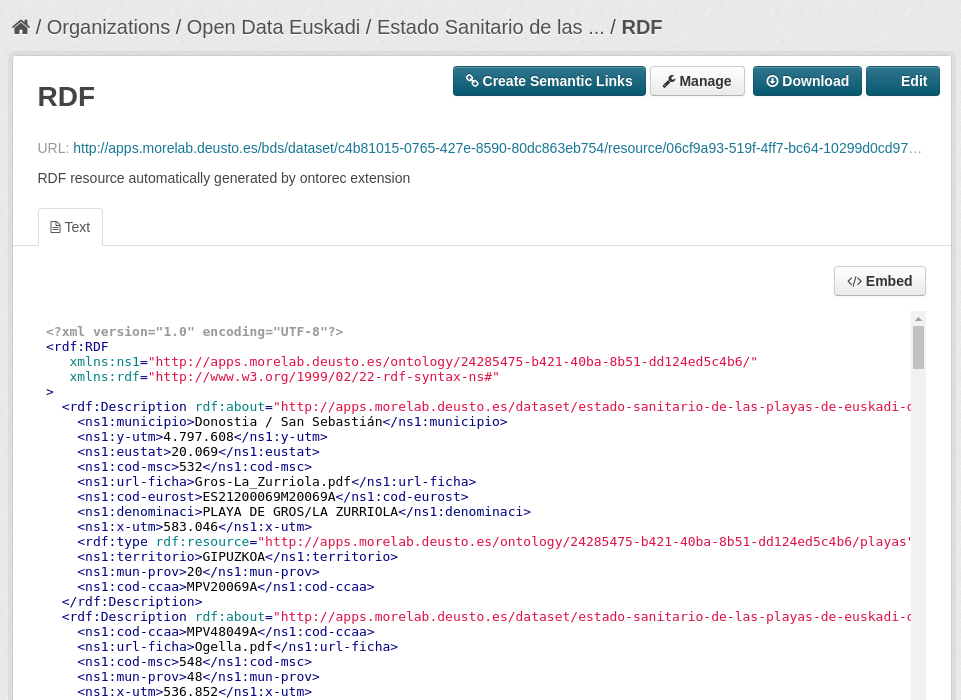
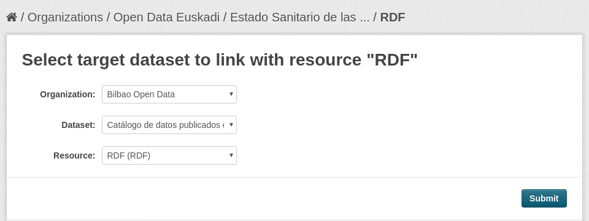
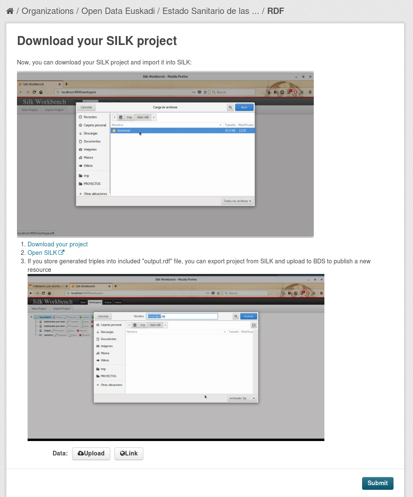

# Silk

ckanext-silk allows linking RDF resources hosted in CKAN through [Silk framework](http://silkframework.org).

In every RDF resource, the "Create Semantic Links" button can be found.

Next, the target RDF resource must be selected:

At last, follow instructions to launch Silk framework and upload the new generated resource into CKAN:

